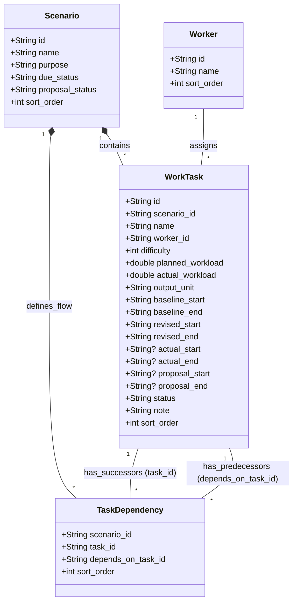

# クラス図定義書

データベース定義に基づいた、ガントチャート管理ソリューションのクラス図です。

## 補足

- `WorkTask` クラスの各日付フィールドは、データベース上は `TEXT` ですが、アプリケーション層では `DateTime` もしくは `String` (ISO 8601形式) として扱われることを想定しています。
- `TaskDependency` は、特定の `Scenario` 内における `WorkTask` 間の自己参照多対多関係を解決するための連関エンティティです。
