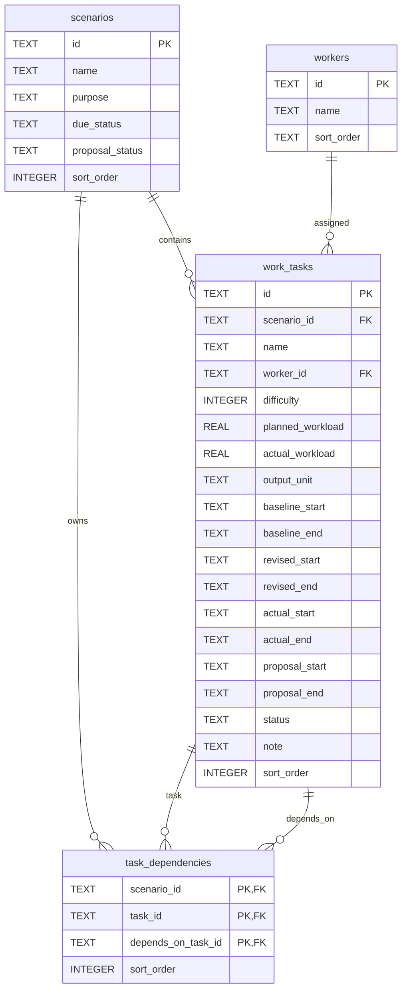

# ER関係図

```mermaid
erDiagram

    scenarios ||--o{ work_tasks : contains
    workers ||--o{ work_tasks : assigned

    scenarios ||--o{ task_dependencies : owns

    work_tasks ||--o{ task_dependencies : task
    work_tasks ||--o{ task_dependencies : depends_on

    scenarios {
        TEXT id PK
        TEXT name
        TEXT purpose
        TEXT due_status
        TEXT proposal_status
        INTEGER sort_order
    }

    workers {
        TEXT id PK
        TEXT name
        TEXT sort_order
    }

    work_tasks {
        TEXT id PK
        TEXT scenario_id FK
        TEXT name
        TEXT worker_id FK
        INTEGER difficulty
        REAL planned_workload
        REAL actual_workload
        TEXT output_unit
        TEXT baseline_start
        TEXT baseline_end
        TEXT revised_start
        TEXT revised_end
        TEXT actual_start
        TEXT actual_end
        TEXT proposal_start
        TEXT proposal_end
        TEXT status
        TEXT note
        INTEGER sort_order
    }

    task_dependencies {
        TEXT scenario_id PK,FK
        TEXT task_id PK,FK
        TEXT depends_on_task_id PK,FK
        INTEGER sort_order
    }
```
