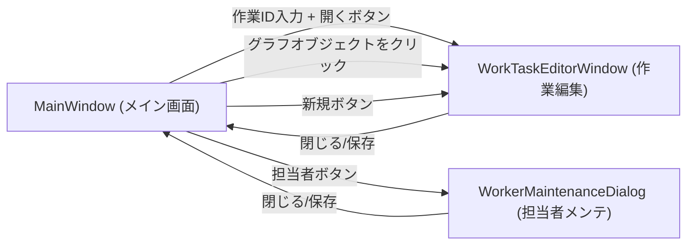

# 画面遷移図

**画面一覧**

- **Main:** [Progress_Management/MainWindow.xaml](Progress_Management/MainWindow.xaml)
- **App（起動／共通資源）:** [Progress_Management/App.xaml](Progress_Management/App.xaml)
- **作業編集ウィンドウ:** [Progress_Management/WorkTaskEditorWindow.xaml](Progress_Management/WorkTaskEditorWindow.xaml)
- **作業者メンテナンス（ダイアログ）:** [Progress_Management/WorkerMaintenanceDialog.xaml](Progress_Management/WorkerMaintenanceDialog.xaml)

**Mermaid 画面遷移**

