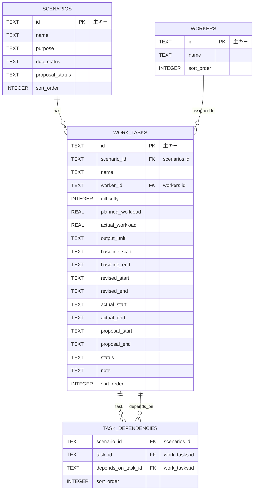

# ER図

以下は `schema.sql` に基づくER図（Mermaid）です。Mermaid対応のレンダラで表示してください。

```mermaid
erDiagram
    SCENARIOS {
        TEXT id PK "主キー"
        TEXT name
        TEXT purpose
        TEXT due_status
        TEXT proposal_status
        INTEGER sort_order
    }
    WORKERS {
        TEXT id PK "主キー"
        TEXT name
        INTEGER sort_order
    }
    WORK_TASKS {
        TEXT id PK "主キー"
        TEXT scenario_id FK "scenarios.id"
        TEXT name
        TEXT worker_id FK "workers.id"
        INTEGER difficulty
        REAL planned_workload
        REAL actual_workload
        TEXT output_unit
        TEXT baseline_start
        TEXT baseline_end
        TEXT revised_start
        TEXT revised_end
        TEXT actual_start
        TEXT actual_end
        TEXT proposal_start
        TEXT proposal_end
        TEXT status
        TEXT note
        INTEGER sort_order
    }
    TASK_DEPENDENCIES {
        TEXT scenario_id FK "scenarios.id"
        TEXT task_id FK "work_tasks.id"
        TEXT depends_on_task_id FK "work_tasks.id"
        INTEGER sort_order
    }

    SCENARIOS ||--o{ WORK_TASKS : "has"
    WORKERS ||--o{ WORK_TASKS : "assigned to"
    WORK_TASKS ||--o{ TASK_DEPENDENCIES : "task"
    WORK_TASKS ||--o{ TASK_DEPENDENCIES : "depends_on"

``` 

## 注意
- `task_dependencies` は同じ `work_tasks` を2つの外部キーで参照します。図では2つの関係（`task` と `depends_on`）として表現しています。
