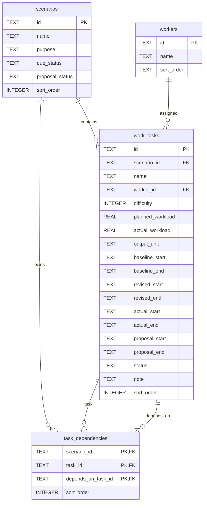
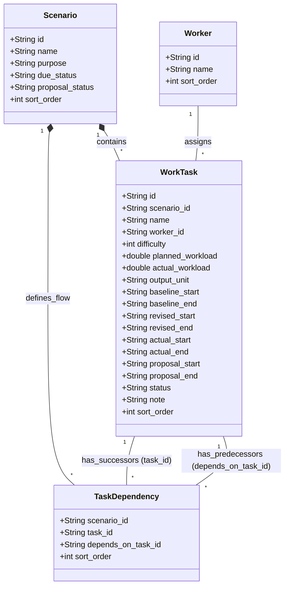
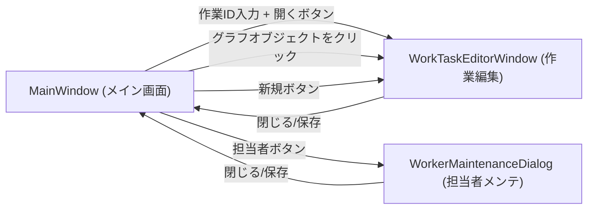
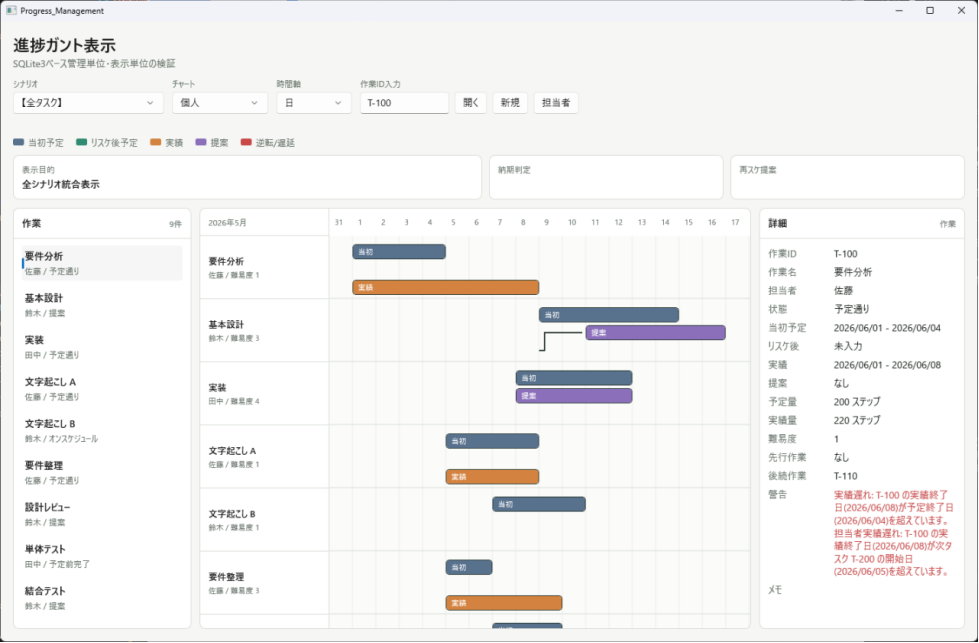
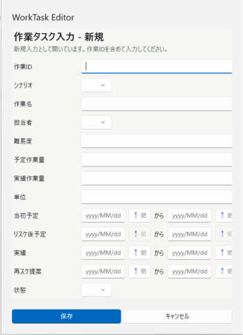

# Progress Management

WinUI 3 / C# による進捗ガント査証プロトです。

## 構成

- `Progress_Management/`: WinUI 3 アプリ本体
- `Progress_Management/Data/schema.sql`: SQLite3 スキーマ
- `Progress_Management/Data/seed.sql`: JSON固定データから変換した初期SQLデータ
- `Progress_Management/Models/ProgressData.cs`: 管理データモデル
- `Progress_Management/Services/ScenarioRepository.cs`: SQLite3読み込み
- `Prototype/`: HTML/JavaScript版の査証プロト

## 現時点の実装範囲

- シナリオ切替
- 個人チャート / プロジェクトチャート切替
- 日 / 週 / 月切替
- 当初予定、リスケ後予定、実績、再スケ提案の表示
- 先行後続関係の簡易表示
- 遅延/逆転マーカー
- ガント要素クリック時の詳細表示

## SQLite3

アプリは初回起動時に以下へSQLite3 DBを作成します。

```text
%LOCALAPPDATA%\Progress_Management\progress_management.db
```

DBeaverでマスターや検証データを編集する場合は、このDBを開きます。

初期データを作り直したい場合は、上記DBを削除してアプリを起動してください。`Data/schema.sql` と `Data/seed.sql` から再作成されます。

##システム設計書

# ガントチャート管理ソリューション 設計書

## 1. データベース定義書

### 1.1 概要

本データベースは、プロジェクト管理におけるガントチャートの進捗管理、および表示シナリオごとのタスク関係を保持するために設計されています。

### 1.2 テーブル定義

#### 1.2.1 scenarios (表示シナリオ)

レビュー単位や進捗状況の切り替え用シナリオを管理します。

| カラム名          | データ型 | 制約        | 説明           |
| ----------------- | -------- | ----------- | -------------- |
| `id`              | TEXT     | PRIMARY KEY | シナリオID     |
| `name`            | TEXT     | NOT NULL    | シナリオ名     |
| `purpose`         | TEXT     | NOT NULL    | 目的           |
| `due_status`      | TEXT     | NOT NULL    | 期限ステータス |
| `proposal_status` | TEXT     | NOT NULL    | 提案ステータス |
| `sort_order`      | INTEGER  | NOT NULL    | 表示順序       |

#### 1.2.2 workers (担当者マスター)

作業を担当するユーザー情報を管理します。

| カラム名     | データ型 | 制約        | 説明     |
| ------------ | -------- | ----------- | -------- |
| `id`         | TEXT     | PRIMARY KEY | 担当者ID |
| `name`       | TEXT     | NOT NULL    | 担当者名 |
| `sort_order` | INTEGER  | NOT NULL    | 表示順序 |

#### 1.2.3 work_tasks (ガントチャート主データ)

タスクの詳細情報、予定、実績、提案状況を集約します。

| カラム名           | データ型 | 制約         | 説明               |
| ------------------ | -------- | ------------ | ------------------ |
| `id`               | TEXT     | PRIMARY KEY  | タスクID           |
| `scenario_id`      | TEXT     | FK, NOT NULL | シナリオID         |
| `name`             | TEXT     | NOT NULL     | タスク名           |
| `worker_id`        | TEXT     | FK, NOT NULL | 担当者ID           |
| `difficulty`       | INTEGER  | NOT NULL     | 難易度             |
| `planned_workload` | REAL     | NOT NULL     | 予定作業量         |
| `actual_workload`  | REAL     | NOT NULL     | 実績作業量         |
| `output_unit`      | TEXT     | NOT NULL     | 出力単位           |
| `baseline_start`   | TEXT     | NOT NULL     | ベースライン開始日 |
| `baseline_end`     | TEXT     | NOT NULL     | ベースライン終了日 |
| `revised_start`    | TEXT     | NULL         | 修正計画開始日     |
| `revised_end`      | TEXT     | NULL         | 修正計画終了日     |
| `actual_start`     | TEXT     | NULL         | 実績開始日         |
| `actual_end`       | TEXT     | NULL         | 実績終了日         |
| `proposal_start`   | TEXT     | NULL         | 提案開始日         |
| `proposal_end`     | TEXT     | NULL         | 提案終了日         |
| `status`           | TEXT     | NOT NULL     | 進捗ステータス     |
| `note`             | TEXT     | NOT NULL     | 備考               |
| `sort_order`       | INTEGER  | NOT NULL     | 表示順序           |

#### 1.2.4 task_dependencies (タスク依存関係)

タスク間の先行・後続関係を保持します。

| カラム名             | データ型 | 制約             | 説明         |
| -------------------- | -------- | ---------------- | ------------ |
| `scenario_id`        | TEXT     | FK, PK, NOT NULL | シナリオID   |
| `task_id`            | TEXT     | FK, PK, NOT NULL | 対象タスクID |
| `depends_on_task_id` | TEXT     | FK, PK, NOT NULL | 先行タスクID |
| `sort_order`         | INTEGER  | NOT NULL         | 表示順序     |

### 1.3 インデックス定義

- **`idx_work_tasks_scenario_order`**
    - 対象テーブル: `work_tasks`
    - カラム: `(scenario_id, sort_order, id)`
- **`idx_task_dependencies_task`**
    - 対象テーブル: `task_dependencies`
    - カラム: `(scenario_id, task_id, sort_order)`

## 2. ER関係図



## 3. クラス図定義書

データベース定義に基づいた、ガントチャート管理ソリューションのクラス図です。



### 補足

- `WorkTask` クラスの各日付フィールドは、データベース上は `TEXT` ですが、アプリケーション層では `DateTime` もしくは `String` (ISO 8601形式) として扱われることを想定しています。
- `TaskDependency` は、特定の `Scenario` 内における `WorkTask` 間の自己参照多対多関係を解決するための連関エンティティです。

## 4. 画面遷移図

### 画面一覧

- **Main:** Progress_Management/MainWindow.xaml
- **App（起動／共通資源）:** Progress_Management/App.xaml
- **作業編集ウィンドウ:** Progress_Management/WorkTaskEditorWindow.xaml
- **作業者メンテナンス（ダイアログ）:** Progress_Management/WorkerMaintenanceDialog.xaml



## 5. 画面キャプチャー

G-0001 メイン画面



G-0002 タスク登録画面



G-0003 タスク編集画面


G-0004 担当者メンテ画面


## 6. メソッド一覧

### App.xaml.cs

| #   | アクセス修飾子       | 戻り値 | メソッド名               | 引数                                                               |
| --- | -------------------- | ------ | ------------------------ | ------------------------------------------------------------------ |
| 1   | `public`             | —      | `App` (コンストラクタ)   | —                                                                  |
| 2   | `private`            | `void` | `App_UnhandledException` | `object sender`, `Microsoft.UI.Xaml.UnhandledExceptionEventArgs e` |
| 3   | `protected override` | `void` | `OnLaunched`             | `Microsoft.UI.Xaml.LaunchActivatedEventArgs args`                  |

### MainWindow.xaml.cs

| #   | アクセス修飾子   | 戻り値                                                        | メソッド名                              | 引数                                                                                                                                                                                                                                                            |
| --- | ---------------- | ------------------------------------------------------------- | --------------------------------------- | --------------------------------------------------------------------------------------------------------------------------------------------------------------------------------------------------------------------------------------------------------------- |
| 1   | `public`         | —                                                             | `MainWindow` (コンストラクタ)           | —                                                                                                                                                                                                                                                               |
| 2   | `private`        | `void`                                                        | `BindControls`                          | —                                                                                                                                                                                                                                                               |
| 3   | `private`        | `void`                                                        | `ScenarioComboBox_SelectionChanged`     | `object sender`, `SelectionChangedEventArgs e`                                                                                                                                                                                                                  |
| 4   | `private`        | `ProgressScenario`                                            | `CreateAllTasksScenario`                | —                                                                                                                                                                                                                                                               |
| 5   | `private`        | `void`                                                        | `ViewModeComboBox_SelectionChanged`     | `object sender`, `SelectionChangedEventArgs e`                                                                                                                                                                                                                  |
| 6   | `private`        | `void`                                                        | `ScaleComboBox_SelectionChanged`        | `object sender`, `SelectionChangedEventArgs e`                                                                                                                                                                                                                  |
| 7   | `private`        | `void`                                                        | `WorkerFilterComboBox_SelectionChanged` | `object sender`, `SelectionChangedEventArgs e`                                                                                                                                                                                                                  |
| 8   | `private`        | `void`                                                        | `TaskListView_SelectionChanged`         | `object sender`, `SelectionChangedEventArgs e`                                                                                                                                                                                                                  |
| 9   | `private async`  | `void`                                                        | `OpenTaskEditorButton_Click`            | `object sender`, `RoutedEventArgs e`                                                                                                                                                                                                                            |
| 10  | `private`        | `void`                                                        | `Render`                                | —                                                                                                                                                                                                                                                               |
| 11  | `private`        | `void`                                                        | `RenderTaskList`                        | —                                                                                                                                                                                                                                                               |
| 12  | `private`        | `void`                                                        | `RenderChart`                           | —                                                                                                                                                                                                                                                               |
| 13  | `private`        | `Grid`                                                        | `BuildTimelineHeader`                   | `(DateTime Start, DateTime End) extent`, `int tickCount`, `double unitWidth`, `int step`                                                                                                                                                                        |
| 14  | `private`        | `void`                                                        | `MovePrevious_Click`                    | `object sender`, `RoutedEventArgs e`                                                                                                                                                                                                                            |
| 15  | `private`        | `void`                                                        | `MoveNext_Click`                        | `object sender`, `RoutedEventArgs e`                                                                                                                                                                                                                            |
| 16  | `private static` | `Border`                                                      | `BuildRowLabel`                         | `string label`, `string subLabel`                                                                                                                                                                                                                               |
| 17  | `private`        | `void`                                                        | `AddTaskBars`                           | `Canvas canvas`, `WorkTask task`, `(DateTime Start, DateTime End) extent`, `double unitWidth`, `int step`                                                                                                                                                       |
| 18  | `private static` | `bool`                                                        | `IsValidDateRange`                      | `string[]? range`                                                                                                                                                                                                                                               |
| 19  | `private`        | `void`                                                        | `AddBar`                                | `Canvas canvas`, `WorkTask task`, `GantBarKind kind`, `string[]? range`, `string label`, `double top`, `string color`, `(DateTime Start, DateTime End) extent`, `double unitWidth`, `int step`                                                                  |
| 20  | `private`        | `void`                                                        | `DrawBarSegment`                        | `Canvas canvas`, `WorkTask task`, `GantBarKind kind`, `DateTime start`, `DateTime end`, `string label`, `double top`, `string color`, `(DateTime Start, DateTime End) extent`, `double unitWidth`, `int step`, `bool isFirst`, `bool isLast`, `bool isSpanning` |
| 21  | `private`        | `void`                                                        | `Bar_Tapped`                            | `object sender`, `TappedRoutedEventArgs e`                                                                                                                                                                                                                      |
| 22  | `private async`  | `void`                                                        | `Bar_DoubleTapped`                      | `object sender`, `DoubleTappedRoutedEventArgs e`                                                                                                                                                                                                                |
| 23  | `private`        | `void`                                                        | `Bar_PointerPressed`                    | `object sender`, `PointerRoutedEventArgs e`, `Canvas canvas`, `(DateTime Start, DateTime End) extent`, `double unitWidth`, `int step`                                                                                                                           |
| 24  | `private`        | `void`                                                        | `Bar_PointerMoved`                      | `object sender`, `PointerRoutedEventArgs e`                                                                                                                                                                                                                     |
| 25  | `private`        | `void`                                                        | `Bar_PointerReleased`                   | `object sender`, `PointerRoutedEventArgs e`                                                                                                                                                                                                                     |
| 26  | `private async`  | `Task`                                                        | `OpenTaskEditor`                        | `string taskId`                                                                                                                                                                                                                                                 |
| 27  | `private async`  | `void`                                                        | `NewTaskEditorButton_Click`             | `object sender`, `RoutedEventArgs e`                                                                                                                                                                                                                            |
| 28  | `private async`  | `void`                                                        | `OpenWorkerMaintenanceButton_Click`     | `object sender`, `RoutedEventArgs e`                                                                                                                                                                                                                            |
| 29  | `private`        | `XamlRoot`                                                    | `GetDialogXamlRoot`                     | —                                                                                                                                                                                                                                                               |
| 30  | `private`        | `void`                                                        | `ReloadAfterTaskEdit`                   | `string taskId`                                                                                                                                                                                                                                                 |
| 31  | `private`        | `void`                                                        | `ReloadAfterWorkerEdit`                 | —                                                                                                                                                                                                                                                               |
| 32  | `private`        | `void`                                                        | `AddAlertMarker`                        | `Canvas canvas`, `WorkTask task`, `(DateTime Start, DateTime End) extent`, `double unitWidth`, `int step`                                                                                                                                                       |
| 33  | `private`        | `void`                                                        | `DrawDependencies`                      | `Canvas canvas`, `WorkTask task`, `Dictionary<string, (WorkTask Task, int Index)> taskById`, `(DateTime Start, DateTime End) extent`, `double unitWidth`, `int step`                                                                                            |
| 34  | `private`        | `void`                                                        | `DrawPersonalDependencies`              | `Canvas canvas`, `WorkTask task`, `List<WorkTask> workerTasks`, `(DateTime Start, DateTime End) extent`, `double unitWidth`, `int step`                                                                                                                         |
| 35  | `private`        | `void`                                                        | `DrawGridLines`                         | `Canvas canvas`, `int tickCount`, `double unitWidth`                                                                                                                                                                                                            |
| 36  | `private`        | `IEnumerable<(string Label, string SubLabel, WorkTask Task)>` | `DisplayRows`                           | —                                                                                                                                                                                                                                                               |
| 37  | `private static` | `DateTime?`                                                   | `PlannedStart`                          | `WorkTask task`                                                                                                                                                                                                                                                 |
| 38  | `private`        | `void`                                                        | `RenderDetail`                          | —                                                                                                                                                                                                                                                               |
| 39  | `private`        | `void`                                                        | `AddDetailRow`                          | `string key`, `string value`                                                                                                                                                                                                                                    |
| 40  | `private`        | `void`                                                        | `AddDetailRow`                          | `string key`, `string value`, `string valueColor`                                                                                                                                                                                                               |
| 41  | `private`        | `string`                                                      | `SuccessorText`                         | `WorkTask task`                                                                                                                                                                                                                                                 |
| 42  | `private`        | `void`                                                        | `AddDependencyWarningRows`              | `WorkTask task`                                                                                                                                                                                                                                                 |
| 43  | `private`        | `bool`                                                        | `HasDependencyWarning`                  | `string predecessorTaskId`, `string successorTaskId`                                                                                                                                                                                                            |
| 44  | `private`        | `IEnumerable<string>`                                         | `DependencyWarningsForTask`             | `WorkTask task`                                                                                                                                                                                                                                                 |
| 45  | `private static` | `(DateTime Start, DateTime End)`                              | `GetExtent`                             | `IEnumerable<WorkTask> tasks`                                                                                                                                                                                                                                   |
| 46  | `private`        | `int`                                                         | `ScaleStep`                             | —                                                                                                                                                                                                                                                               |
| 47  | `private`        | `double`                                                      | `UnitWidth`                             | —                                                                                                                                                                                                                                                               |
| 48  | `private`        | `string`                                                      | `ScaleLabel`                            | `DateTime date`                                                                                                                                                                                                                                                 |
| 49  | `private static` | `double`                                                      | `ScaledLeft`                            | `DateTime extentStart`, `string date`, `double unitWidth`, `int step`                                                                                                                                                                                           |
| 50  | `private static` | `double`                                                      | `ScaledLeft`                            | `DateTime extentStart`, `DateTime dt`, `double unitWidth`, `int step`                                                                                                                                                                                           |
| 51  | `private static` | `double`                                                      | `ScaledWidth`                           | `string[] range`, `double unitWidth`, `int step`                                                                                                                                                                                                                |
| 52  | `private static` | `double`                                                      | `ScaledWidth`                           | `DateTime start`, `DateTime end`, `double unitWidth`, `int step`                                                                                                                                                                                                |
| 53  | `private static` | `DateTime`                                                    | `ParseDate`                             | `string value`                                                                                                                                                                                                                                                  |
| 54  | `private static` | `string`                                                      | `RangeDisplay`                          | `string dateString`                                                                                                                                                                                                                                             |
| 55  | `private static` | `string`                                                      | `RangeText`                             | `string[]? range`                                                                                                                                                                                                                                               |
| 56  | `private static` | `string?`                                                     | `DependencyWarning`                     | `WorkTask predecessor`, `WorkTask successor`                                                                                                                                                                                                                    |
| 57  | `private static` | `string`                                                      | `KindLabel`                             | `GantBarKind kind`                                                                                                                                                                                                                                              |
| 58  | `private static` | `string`                                                      | `StatusLabel`                           | `string status`                                                                                                                                                                                                                                                 |
| 59  | `private static` | `SolidColorBrush`                                             | `Brush`                                 | `string hex`                                                                                                                                                                                                                                                    |

### WorkTaskEditorWindow.xaml.cs

| #   | アクセス修飾子   | 戻り値               | メソッド名                              | 引数                                                                                                                              |
| --- | ---------------- | -------------------- | --------------------------------------- | --------------------------------------------------------------------------------------------------------------------------------- |
| 1   | `public`         | —                    | `WorkTaskEditorWindow` (コンストラクタ) | `string taskId`, `string currentScenarioId`, `bool createNew`                                                                     |
| 2   | `private static` | `WorkTaskEditRecord` | `CreateNewRecord`                       | `string currentScenarioId`                                                                                                        |
| 3   | `private`        | `void`               | `LoadRecord`                            | `WorkTaskEditRecord record`                                                                                                       |
| 4   | `private static` | `DateTimeOffset?`    | `ToPickerDate`                          | `string? value`                                                                                                                   |
| 5   | `private static` | `void`               | `SelectLookupItem`                      | `ComboBox comboBox`, `IReadOnlyList<LookupItem> items`, `string id`                                                               |
| 6   | `private static` | `void`               | `LoadDatePickerPair`                    | `CalendarDatePicker picker`, `TextBox textBox`, `string? dateString`                                                              |
| 7   | `private`        | `void`               | `OnDateChanged`                         | `CalendarDatePicker sender`, `CalendarDatePickerDateChangedEventArgs args`                                                        |
| 8   | `private`        | `void`               | `UpdateTextBoxForPicker`                | `CalendarDatePicker picker`                                                                                                       |
| 9   | `private`        | `void`               | `OnRevisedScheduleOptionalChanged`      | `object sender`, `RoutedEventArgs e`                                                                                              |
| 10  | `private`        | `void`               | `SaveButton_Click`                      | `ContentDialog sender`, `ContentDialogButtonClickEventArgs args`                                                                  |
| 11  | `private`        | `bool`               | `TryBuildRecord`                        | `out WorkTaskEditRecord record`                                                                                                   |
| 12  | `private`        | `bool`               | `ValidateRelationIds`                   | `string currentTaskId`, `string scenarioId`, `IReadOnlyList<string> predecessorTaskIds`, `IReadOnlyList<string> successorTaskIds` |
| 13  | `private static` | `List<string>`       | `SplitTaskIds`                          | `string value`                                                                                                                    |
| 14  | `private static` | `bool`               | `IsOptionalPickerPair`                  | `CalendarDatePicker start`, `CalendarDatePicker end`                                                                              |
| 15  | `private static` | `string`             | `ToStorageDate`                         | `CalendarDatePicker picker`                                                                                                       |
| 16  | `private static` | `string?`            | `ToOptionalStorageDate`                 | `CalendarDatePicker picker`                                                                                                       |
| 17  | `private`        | `void`               | `CancelButton_Click`                    | `ContentDialog sender`, `ContentDialogButtonClickEventArgs args`                                                                  |

### WorkerMaintenanceDialog.xaml.cs

| #   | アクセス修飾子 | 戻り値 | メソッド名                                 | 引数                                           |
| --- | -------------- | ------ | ------------------------------------------ | ---------------------------------------------- |
| 1   | `public`       | —      | `WorkerMaintenanceDialog` (コンストラクタ) | —                                              |
| 2   | `private`      | `void` | `LoadWorkers`                              | `string? selectedWorkerId = null`              |
| 3   | `private`      | `void` | `WorkerListView_SelectionChanged`          | `object sender`, `SelectionChangedEventArgs e` |
| 4   | `private`      | `void` | `LoadWorker`                               | `WorkerEditRecord? worker`                     |
| 5   | `private`      | `void` | `NewButton_Click`                          | `object sender`, `RoutedEventArgs e`           |
| 6   | `private`      | `void` | `SaveButton_Click`                         | `object sender`, `RoutedEventArgs e`           |
| 7   | `private`      | `void` | `DeleteButton_Click`                       | `object sender`, `RoutedEventArgs e`           |

### ScheduleWarningService.cs

| #   | アクセス修飾子   | 戻り値                  | メソッド名           | 引数                                                                                                |
| --- | ---------------- | ----------------------- | -------------------- | --------------------------------------------------------------------------------------------------- |
| 1   | `public static`  | `List<ScheduleWarning>` | `Analyze`            | `IEnumerable<WorkTask> tasks`                                                                       |
| 2   | `private static` | `void`                  | `AddProjectWarnings` | `WorkTask task`, `IReadOnlyDictionary<string, WorkTask> taskById`, `List<ScheduleWarning> warnings` |
| 3   | `private static` | `void`                  | `AddWorkerWarnings`  | `IReadOnlyList<WorkTask> tasks`, `List<ScheduleWarning> warnings`                                   |
| 4   | `private static` | `DateTime?`             | `PlannedStart`       | `WorkTask task`                                                                                     |
| 5   | `private static` | `DateTime?`             | `PlannedEnd`         | `WorkTask task`                                                                                     |
| 6   | `private static` | `DateTime?`             | `EffectiveStart`     | `WorkTask task`                                                                                     |
| 7   | `private static` | `DateTime?`             | `EffectiveEnd`       | `WorkTask task`                                                                                     |
| 8   | `private static` | `DateTime?`             | `RangeStart`         | `string[]? range`                                                                                   |
| 9   | `private static` | `DateTime?`             | `RangeEnd`           | `string[]? range`                                                                                   |
| 10  | `private static` | `DateTime?`             | `Parse`              | `string value`                                                                                      |
| 11  | `private static` | `string`                | `Display`            | `DateTime value`                                                                                    |

### ScenarioRepository.cs

| #   | アクセス修飾子   | 戻り値                   | メソッド名                    | 引数                                                                               |
| --- | ---------------- | ------------------------ | ----------------------------- | ---------------------------------------------------------------------------------- |
| 1   | `public static`  | `ProgressScenarioSet`    | `Load`                        | —                                                                                  |
| 2   | `public static`  | `List<LookupItem>`       | `LoadScenarioOptions`         | —                                                                                  |
| 3   | `public static`  | `List<LookupItem>`       | `LoadWorkerOptions`           | —                                                                                  |
| 4   | `public static`  | `List<WorkerEditRecord>` | `LoadWorkersForEdit`          | —                                                                                  |
| 5   | `public static`  | `void`                   | `SaveWorker`                  | `WorkerEditRecord record`                                                          |
| 6   | `public static`  | `bool`                   | `DeleteWorker`                | `string workerId`, `out string message`                                            |
| 7   | `public static`  | `List<string>`           | `LoadTaskIds`                 | `string scenarioId`                                                                |
| 8   | `public static`  | `List<string>`           | `LoadAllTaskIds`              | —                                                                                  |
| 9   | `public static`  | `WorkTaskEditRecord?`    | `LoadWorkTaskForEdit`         | `string taskId`                                                                    |
| 10  | `public static`  | `void`                   | `SaveWorkTask`                | `WorkTaskEditRecord record`                                                        |
| 11  | `public static`  | `void`                   | `UpdateTaskDates`             | `string taskId`, `string kind`, `string startDate`, `string endDate`               |
| 12  | `private static` | `List<WorkTask>`         | `LoadTasks`                   | `SqliteConnection connection`, `string scenarioId`                                 |
| 13  | `private static` | `int`                    | `NextSortOrder`               | `SqliteConnection connection`, `string scenarioId`                                 |
| 14  | `private static` | `int`                    | `NextWorkerSortOrder`         | `SqliteConnection connection`                                                      |
| 15  | `private static` | `void`                   | `AddParameter`                | `SqliteCommand command`, `string name`, `object? value`                            |
| 16  | `private static` | `void`                   | `ClearSurplusRescheduleDates` | `SqliteConnection connection`, `WorkTaskEditRecord record`                         |
| 17  | `private static` | `void`                   | `ClearSurplusForSuccessors`   | `SqliteConnection connection`, `string predecessorTaskId`, `string actualEndStr`   |
| 18  | `private static` | `void`                   | `ClearSurplusForPredecessors` | `SqliteConnection connection`, `string successorTaskId`, `string baselineStartStr` |
| 19  | `private static` | `string?`                | `GetTaskScenarioId`           | `SqliteConnection connection`, `string taskId`                                     |
| 20  | `private static` | `void`                   | `SaveTaskDependencies`        | `SqliteConnection connection`, `WorkTaskEditRecord record`                         |
| 21  | `private static` | `List<string>`           | `LoadDependencies`            | `SqliteConnection connection`, `string scenarioId`, `string taskId`                |
| 22  | `private static` | `List<string>`           | `LoadSuccessors`              | `SqliteConnection connection`, `string scenarioId`, `string taskId`                |
| 23  | `private static` | `string[]?`              | `NullableRange`               | `SqliteDataReader reader`, `int startIndex`, `int endIndex`                        |
| 24  | `private static` | `void`                   | `EnsureDatabase`              | —                                                                                  |
| 25  | `private static` | `void`                   | `ExecuteSqlScript`            | `SqliteConnection connection`, `string fileName`                                   |

### ScheduleWarning.cs

| #   | アクセス修飾子 | 戻り値 | メソッド名          | 引数                                                 |
| --- | -------------- | ------ | ------------------- | ---------------------------------------------------- |
| 1   | `public`       | `bool` | `Involves`          | `string taskId`                                      |
| 2   | `public`       | `bool` | `MatchesDependency` | `string predecessorTaskId`, `string successorTaskId` |

### WorkTaskEditRecord.cs

| #   | アクセス修飾子    | 戻り値   | メソッド名 | 引数           |
| --- | ----------------- | -------- | ---------- | -------------- |
| 1   | `public override` | `string` | `ToString` | — (LookupItem) |
